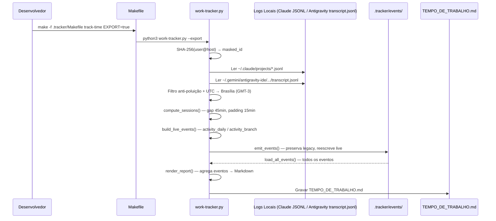

# 📊 Project Context — Rastreador de Tempo de Desenvolvimento (IA)

> Documento consolidado de contexto do projeto para a ferramenta de rastreamento de tempo ativo com assistentes de IA. Reúne todas as especificações, decisões arquiteturais, pesquisas técnicas e trabalho diferido num único ponto de referência.

---

## 1. Visão Geral do Produto

O **Rastreador de Tempo Ativo (IA)** é um micro-sistema analítico privado e offline que vive isolado na pasta `.tracker/` do repositório `cluster-kubernetes`. Ele minera dados de transações locais de dois assistentes de IA — **Antigravity** (extensão de IDE) e **Claude Code** (CLI) — e consolida as métricas em tabelas diárias compartilhadas de forma segura, anônima e colaborativa.

### Objetivos
- Auditar de forma justa e transparente o tempo produtivo acumulado com ferramentas de IA
- Rastreamento tridimensional: **tempo × modelo LLM × ferramenta**
- Rastreamento de esforço por **branch/história** (story tracking)
- Consolidação multi-desenvolvedor com anonimato por hash SHA-256
- Zero dependências externas, zero configuração manual

---

## 2. Stack Tecnológica

| Componente | Tecnologia |
|------------|-----------|
| Linguagem | Python 3.x (stdlib pura: `os`, `re`, `json`, `glob`, `hashlib`, `socket`, `datetime`) |
| Interface DX | GNU Make (Makefile apartado em `.tracker/Makefile`) |
| Fuso Horário | Brasília GMT-3 (America/Sao_Paulo) |
| Saída Analítica | Markdown GFM (GitHub Flavored Markdown) |
| Fontes de Dados | `~/.claude/projects/*.jsonl` (Claude Code) + `~/.gemini/antigravity-ide/brain/*/.system_generated/logs/transcript.jsonl` (Antigravity) |

---

## 3. Estrutura de Arquivos

```text
.tracker/
├── Makefile                        # DX Interface: make track-time / make bootstrap
├── README.md                       # Guia do desenvolvedor
├── BACKLOG.md                      # Backlog consolidado de melhorias e dívida técnica
├── work-tracker-architecture.md    # Documento de Decisões de Arquitetura (ADR)
├── work-tracker.py                 # Analytics Engine: coleta, compute_sessions, render_report
├── bootstrap_events.py             # Bootstrap one-shot: captura legado → eventos legacy JSONL
├── TEMPO_DE_TRABALHO.md            # Relatório Markdown (renderização dos eventos)
├── project-context.md              # Este documento
├── events/                         # Store de eventos por desenvolvedor
│   ├── dev-<hash>.jsonl            # Eventos activity_daily / activity_branch / dev_summary
│   └── manifest.json               # legacy_boundary por dev (datetime naive BRT ISO)
├── specs/                          # Especificações de features e bugfixes
│   ├── spec-tracker-orientado-a-eventos.md
│   ├── spec-branch-tracking-work-tracker.md
│   ├── spec-tempo-total-desenvolvedores-e-branches.md
│   ├── spec-ferramenta-dimensao-relatorio.md
│   └── spec-fix-antigravity-model-extraction-regex.md
├── reviews/                        # Reviews e prompts de revisão
├── research/                       # Pesquisas técnicas
└── scratch/
    └── test_tracker.py             # Testes unitários (unittest)
```

---

## 4. Decisões de Arquitetura (ADRs)

### ADR-01: Isolamento de Escopo
Toda a lógica, automações e relatórios vivem em `.tracker/`. O Makefile principal e `scripts/` permanecem focados apenas em infraestrutura.

### ADR-02: Agrupamento por Sessões Ativas (Session Gap)
- Gap máximo entre interações: **45 minutos** (configurável via `--gap`)
- Sessões com menos de 15 minutos: padding automático para 15 min (engajamento mínimo)

### ADR-03: Prevenção de Dupla Contagem
- **Mesclagem Global:** Todos os timestamps (ambas ferramentas) são concatenados e ordenados cronologicamente antes do agrupamento
- **Alocação de Ociosidade:** Tempo idle creditado ao modelo da interação anterior imediata
- **Filtro Anti-Poluição:** Pings órfãos sem prompt de usuário são descartados

### ADR-04: Privacidade por Mascaramento SHA-256
Identidade mascarada com hash determinístico de 8 caracteres: `dev-[hash]` calculado de `usuario@hostname`.

### ADR-05: Rastreamento Dinâmico por Modelo (LLM)
- **Claude Code:** Mineração de `"model"` em JSONL sob `~/.claude/projects/`
- **Antigravity:** Rastreamento de `<USER_SETTINGS_CHANGE>` em `transcript.jsonl` (`~/.gemini/antigravity-ide/brain/*/.system_generated/logs/`); coerção `content = data.get("content") or ""` para entradas com `content: null`

### ADR-07: Arquitetura Orientada a Eventos e Camada de Dados JSONL
- Eventos (`activity_daily`, `activity_branch`, `dev_summary`) gravados em `.tracker/events/dev-<hash>.jsonl`
- Eventos `legacy: true` capturados por `bootstrap_events.py` (one-shot, idempotente); nunca recomputados
- Eventos `live` filtrados para `dt_br > legacy_boundary` (sem dupla contagem)
- `TEMPO_DE_TRABALHO.md` é renderização pura via `render_report()`; nunca mais lido como dado
- `model_confidence`: `"confirmado"` para Claude Code e Antigravity com detecção explícita; `"indeterminado"` para legado de Antigravity (fonte era `overview.txt` truncado)
- Seam `emit_events()` projetado para receber `KafkaEventSink` no futuro (fora de escopo atual)

### ADR-06: Propagação Cronológica de Estado e Zero-Config
- Modelo de fábrica padrão: `Gemini 3.1 Pro (High)`
- Trocas de modelo propagam estado para sessões subsequentes até nova troca
- Pass 1: Ancora modelo inicial 1ms antes do primeiro turno (captura "from" real)
- Pass 2: Rastreia mudanças subsequentes via `<USER_SETTINGS_CHANGE>`

---

## 5. Funcionalidades Implementadas

### 5.1 Relatório por Modelo LLM e Ferramenta
- Tabela diária com dimensões: **Dia × Ferramenta × Modelo LLM**
- Seção de totais por ferramenta (Antigravity vs Claude Code)
- Normalização de nomes de modelos (`normalize_model_name`)

### 5.2 Rastreamento por Branch / História
- Parsing de `.git/logs/HEAD` (reflog) para reconstruir timeline de checkouts
- Mapeamento de cada ping para branch ativa no timestamp exato
- Tabela com colunas: **Dia × Branch × Ferramentas × Modelos × Tempo × Interações**

### 5.3 Consolidação Multi-Desenvolvedor
- Resumo geral com tempo total somado de todos os devs
- Tabela global de tempo por branch consolidado
- Preservação de blocos de outros desenvolvedores (imutabilidade)

### 5.4 Saída de Console
- Métricas formatadas com cores ANSI agrupadas por ferramenta/modelo
- Exibição do ID anônimo para rastreabilidade interna

---

## 6. Fluxo de Dados (Pipeline)



---

## 7. Trabalho Diferido (Backlog Técnico)

### Prioridade Alta
- ~~**BKL-026 — Antigravity trunca eventos de troca de modelo:**~~ ✅ Resolvido — migrado para `transcript.jsonl` (sem truncamento).
- **Regex `(.*?)\.` trunca nomes com ponto:** payload `"to Gemini 3.1 Pro."` captura `"Gemini 3"`. Precisa sentinela mais robusto. (BKL-004)

### Prioridade Média
- **Detached HEAD como SHA de branch:** checkout para SHA aparece como nome de branch no relatório. Adicionar pós-processamento com regex `^[0-9a-f]{7,40}$`.
- **Sessões cruzando meia-noite:** toda a sessão é atribuída à data do primeiro evento. Dividir no limite de meia-noite.
- **Interações entre troca de branch em sessão:** gap entre pings de branches diferentes é inteiramente atribuído à branch anterior.

### Prioridade Baixa
- **Múltiplos `<USER_SETTINGS_CHANGE>` por linha JSON:** `re.search` captura apenas a primeira ocorrência.
- **`-\d{8}\b` pode remover sufixos numéricos não-data:** latente, nenhum modelo atual é afetado.
- **Inconsistência de padrão de guarda de tabelas vazias:** Tabela 1 vs Tabela 2 usam padrões diferentes.
- **Eventos `is_change` sem campo `active_model`:** risco de KeyError se o filtro `is_ping` mudar.

---

## 8. Segurança e Validação

- **Prevenção de Injeção:** Logs purificados contra quebras de linha e caracteres não-JSON
- **Idempotência:** Execuções sucessivas não causam efeitos colaterais
- **Segurança de Paths:** Caminhos de varredura baseados em `os.path.expanduser`, sem travessia de diretório
- **Imutabilidade de Outros Blocos:** Blocos de outros desenvolvedores nunca são alterados
- **Deduplicação Dinâmica:** Registro antigo do mesmo dev é substituído in-place

---

## 9. Comandos de Uso

```bash
# Visualizar métricas no terminal (sem persistir)
make -f .tracker/Makefile track-time

# Exportar/atualizar relatório colaborativo
make -f .tracker/Makefile track-time EXPORT=true

# Executar com gap customizado (default: 45 min)
python3 .tracker/work-tracker.py --gap 30 --export
```
