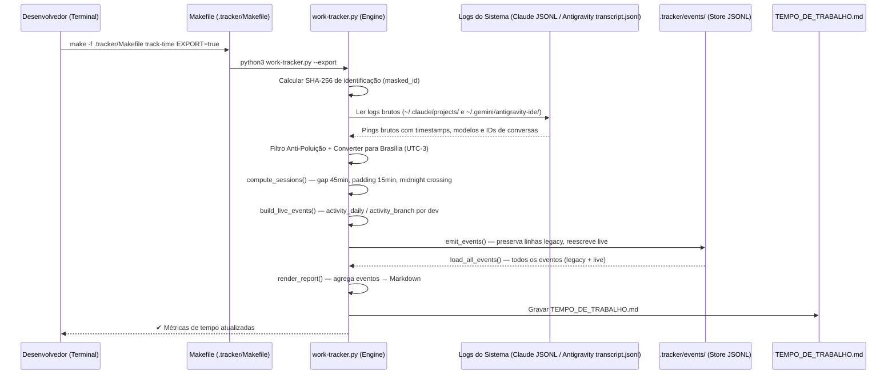

# 📖 Documento de Decisão de Arquitetura (BMad)

Este documento de especificação foi estruturado sob o **Padrão de Arquitetura BMad**, consolidando de forma disciplinada, modular e orientada a decisões a engenharia reversa e a arquitetura de solução do utilitário de métricas de tempo ativo.

---

## 1. Contexto do Projeto e Escopo

### 1.1. Contexto
No desenvolvimento ágil moderno, o uso de assistentes de Inteligência Artificial (**Antigravity** como extensão de IDE/Cursor e **Claude Code** como ferramenta de linha de comando CLI) tornou-se parte vital do tempo de trabalho ativo. No entanto, não havia um mecanismo padronizado, offline e coeso para auditar de forma justa e transparente o tempo produtivo acumulado com essas tecnologias em um repositório git comum.

### 1.2. Escopo da Solução
O **Rastreador de Tempo Ativo (IA)** é um micro-sistema analítico privado, projetado para viver de forma 100% isolada e offline dentro da pasta oculta `.tracker/` na raiz do repositório. Ele mina dados de transações locais dos agentes, consolidando-os em tabelas diárias compartilhadas de forma segura e colaborativa.

---

## 2. Limites do Sistema e Stack Tecnológica

O utilitário foi construído com foco em **zero dependências externas corporativas** para garantir compatibilidade universal em qualquer ambiente de desenvolvimento (Linux/OSX):

*   **Linguagem de Execução:** Python 3.x (utilizando estritamente a biblioteca padrão `stdlib` - `os`, `re`, `json`, `glob`, `hashlib`, `socket`, `datetime`).
*   **Interface do Desenvolvedor (DX):** GNU Make (Makefile apartado sob `.tracker/Makefile`).
*   **Fuso Horário de Referência:** Fuso Horário de Brasília (GMT-3 / America/Sao_Paulo).
*   **Destino Analítico:** Arquivos Markdown com tags estendidas GFM (GitHub Flavored Markdown).

---

## 3. Decisões de Design de Solução (ADRs - Architecture Decision Records)

### ADR-01: Isolamento de Escopo da Ferramenta de Métricas
*   **Status:** Aprovado
*   **Contexto:** O projeto principal visa automatizar e implantar um cluster Kubernetes local via GitOps. Incluir lógicas de métricas no Makefile principal ou na pasta `scripts/` da raiz violaria a coesão do repositório.
*   **Decisão:** Centralizar toda a lógica, automações e relatórios Markdown em uma pasta oculta específica e apartada: `.tracker/`.
*   **Consequência:** Limpeza absoluta na raiz do projeto; o Makefile principal e a pasta `scripts/` permanecem focados apenas em automação de infraestrutura.

### ADR-02: Algoritmo de Agrupamento por Sessões Ativas (*Session Gap*)
*   **Status:** Aprovado
*   **Contexto:** O tempo de desenvolvimento com IA é intermitente. Não podemos apenas medir a diferença do primeiro para o último commit.
*   **Decisão:** Implementar agrupamento de comandos brutas consecutivos. Se a diferença de tempo entre duas interações for **menor ou igual a 45 minutos**, elas fazem parte da mesma sessão ativa. Sessões curtas com menos de 15 minutos são arredondadas para 15 minutos (engajamento mínimo).
*   **Consequência:** Precisão científica no cálculo do tempo real em que o desenvolvedor esteve focado na IDE/CLI.

### ADR-03: Prevenção de Dupla Contagem (Mesclagem Global e Alocação Cruzada)
*   **Status:** Aprovado
*   **Contexto:** O desenvolvedor pode alternar rapidamente entre IDE (Antigravity) e console (Claude Code) na mesma janela de 45 minutos. Somar as horas de ambas de forma isolada duplicaria o tempo de desenvolvimento real (ex: gerando '2 horas de trabalho' dentro de 1 hora de relógio).
*   **Decisão:**
    *   **Mesclagem Absoluta:** Realizar a concatenação e ordenação global cronológica de todos os carimbos de data/hora (já convertidos para Brasília GMT-3) *antes* de rodar o algoritmo de agrupamento de sessão.
    *   **Alocação de Ociosidade (Gap):** O tempo ocioso entre duas interações distintas (mesmo que de ferramentas/LLMs diferentes) será creditado ao modelo responsável pela interação *anterior* imediata.
    *   **Filtro Anti-Poluição:** A coleta deve filtrar pings órfãos vazios (ex: inicializações de serviço que não possuam prompt do usuário) para garantir que a métrica de "Total de Interações" reflita uso genuíno.
*   **Consequência:** Obtenção de um **Tempo Combinado Único** líquido e justo, livre de sobreposições de uso simultâneo, onde o esforço faturado reflete com exatidão a realidade do relógio, independentemente da troca constante de assistentes.

### ADR-04: Privacidade por Mascaramento SHA-256
*   **Status:** Aprovado
*   **Contexto:** Comitar logs de desenvolvimento em repositórios públicos externos no GitHub pode vazar informações sigilosas como nomes de usuários de sistemas operacionais e nomes de computadores da rede interna corporativa.
*   **Decisão:** Substituir a identificação em texto claro por um hash SHA-256 determinístico de 8 caracteres (`dev-[hash]`), calculado combinando `usuario@computador`.
*   **Consequência:** Anonimato impecável para auditores e público externo, enquanto o time mantém a rastreabilidade interna ao ver seus hashes gerados na saída privada do terminal local.

### ADR-05: Rastreamento Dinâmico por Modelo (LLM) e Mineração de Claude CLI JSONL
*   **Status:** Aprovado
*   **Contexto:** Diferentes assistentes de IA utilizam diferentes LLMs (ex: Gemini 3.1 Pro, Gemini 3 Flash, Sonnet 4.6, Opus 4.7) em momentos e contextos distintos. Para fins de auditoria de eficiência e custos, o time precisa de rastreamento tridimensional (tempo, data e modelo).
*   **Decisão:**
    *   **Claude Code:** Minar diretamente as bases de dados locais em formato texto plano JSONL sob `~/.claude/projects/`, extraindo a chave `"model"` exata de cada turno de conversação de forma 100% determinística.
    *   **Antigravity:** Rastrear alterações de configuração (`USER_SETTINGS_CHANGE`) nos logs locais (`~/.gemini/antigravity-ide/brain/*/.system_generated/logs/transcript.jsonl`), com coerção `content = data.get("content") or ""` para entradas com `content: null`.
*   **Consequência:** Obtenção de relatórios analíticos tridimensionais detalhando com precisão comercial qual modelo de IA consumiu cada parcela do esforço de desenvolvimento.

### ADR-06: Propagação Cronológica de Estado e Zero-Config
*   **Status:** Aprovado
*   **Contexto:** No Antigravity IDE, o log de troca de modelo só é gerado no chat se o desenvolvedor mudar a opção no dropdown no meio da sessão. Historicamente, os desenvolvedores podem iniciar projetos já utilizando o padrão da IDE sem que isso registre um log inicial explícito.
*   **Decisão:**
    *   **Premissa do Modelo de Fábrica:** Como o comportamento nativo do Antigravity ao ser instalado e iniciado é utilizar o `Gemini 3.1 Pro (High)`, a heurística do rastreador assumirá este modelo como sendo o **ativo** para todas as interações no início do tempo de vida do projeto, até que a primeira tag `<USER_SETTINGS_CHANGE>` no histórico indique uma alteração contrária.
    *   **Propagação Cronológica de Estado:** Uma vez que uma troca via dropdown for mapeada (`<USER_SETTINGS_CHANGE>`), o novo modelo será considerado o "Modelo Ativo", propagando essa herança para as próximas conversas até encontrar outra alteração na linha do tempo.
    *   **Assertividade nas Métricas:** Para justificar auditorias precisas, as saídas no painel e na tabela deverão separar claramente **Horas Efetivas**, **Número de Sessões** (grupos lógicos de esforço ininterrupto) e **Total de Interações** por cada modelo LLM diário.
*   **Consequência:** Simplifica absolutamente a rotina do desenvolvedor por meio de uma arquitetura estritamente zero-config, eliminando qualquer dependência humana de manutenção de arquivos de calibração.

### ADR-07: Arquitetura Orientada a Eventos e Camada de Dados JSONL
*   **Status:** Aprovado
*   **Contexto:** O relatório `TEMPO_DE_TRABALHO.md` era a própria fonte da verdade — relido por regex (`parse_existing_developers_stats`). Frágil e sem caminho de evolução. Adicionalmente, o Antigravity IDE migrou seus logs de `overview.txt` (com truncamento) para `transcript.jsonl` (sem truncamento, com `<USER_SETTINGS_CHANGE>` preservado).
*   **Decisão:**
    *   **Eventos como fonte canônica:** cada execução deriva **eventos de atividade** (`activity_daily`, `activity_branch`, `dev_summary`) gravados em JSONL (um por linha) em `.tracker/events/dev-<hash>.jsonl`.
    *   **Eventos `legacy` vs `live`:** o bootstrap one-shot (`bootstrap_events.py`) captura o histórico do `TEMPO_DE_TRABALHO.md` como eventos `legacy: true`, congelados e nunca recomputados. Execuções subsequentes produzem apenas eventos `live: false`, filtrados para `dt_br > legacy_boundary`.
    *   **Relatório como renderização:** `render_report()` agrega os eventos e gera o Markdown; `TEMPO_DE_TRABALHO.md` nunca mais é lido como dado.
    *   **`model_confidence`:** eventos live do Antigravity com `USER_SETTINGS_CHANGE` detectado recebem `"confirmado"`; fallback de fábrica recebe `"confirmado"` por ADR-06; eventos legacy de Antigravity recebem `"indeterminado"` (fonte histórica era `overview.txt` truncado).
    *   **Seam Kafka:** `emit_events()` é o único ponto de saída — projetado para receber um `KafkaEventSink` no futuro sem alterar o restante do pipeline (fora de escopo atual).
*   **Consequência:** Separação total entre dados (JSONL) e apresentação (Markdown). Elimina `parse_existing_developers_stats`. Habilita auditoria por evento, multi-dev trivial e publicação futura em streaming.

---

## 4. Estrutura de Pastas e Componentes

A arquitetura de arquivos sob `.tracker/` está organizada de forma modular:

```text
.tracker/
├── Makefile                    # DX Interface: make track-time / make bootstrap
├── README.md                   # Developer Guide: instruções de uso
├── work-tracker-architecture.md# Architecture Spec: este documento
├── work-tracker.py             # Analytics Engine: coleta, compute_sessions, render_report
├── bootstrap_events.py         # Bootstrap one-shot: captura legado → eventos legacy JSONL
├── BACKLOG.md                  # Backlog consolidado de melhorias e dívida técnica
├── TEMPO_DE_TRABALHO.md        # Relatório Markdown (renderização dos eventos)
├── project-context.md          # Contexto consolidado do projeto
├── events/                     # Store de eventos por desenvolvedor
│   ├── dev-<hash>.jsonl        # Eventos activity_daily / activity_branch / dev_summary por dev
│   └── manifest.json           # legacy_boundary por dev (datetime naive BRT ISO)
├── specs/                      # Especificações de features e bugfixes
├── reviews/                    # Prompts e resultados de code review
├── research/                   # Pesquisas técnicas
└── scratch/
    └── test_tracker.py         # Testes unitários (unittest)
```

---

## 5. Padrões de Implementação e Regras de Consistência

Para garantir que novos desenvolvedores adicionem suporte a novas IAs no futuro de forma coesa, as seguintes diretrizes de consistência são impostas:

1.  **Imutabilidade de Outros Blocos:** Ao escrever no arquivo [TEMPO_DE_TRABALHO.md](file:///home/ismael.sjunior/git-pessoal/cluster-kubernetes/.tracker/TEMPO_DE_TRABALHO.md), o analisador deve **sempre ler o arquivo anterior**, filtrar blocos com IDs mascarados diferentes e reescrevê-los exatamente como estavam. Blocos de outros desenvolvedores nunca devem ser alterados ou apagados.
2.  **Deduplicação Dinâmica:** Se o ID mascarado do desenvolvedor atual já possuir um registro prévio no arquivo, este registro antigo deve ser **substituído in-place** pela nova medição recalculada, em vez de criar múltiplos blocos duplicados para a mesma máquina.
3.  **Fuso Horário Local Estrito:** Toda exibição de data e hora no Markdown ou console de métricas deve utilizar o fuso horário de Brasília (GMT-3) de forma proativa.

---

## 6. Fluxo de Dados e Interfaces de Componentes

### 6.1. Fluxo de Execução do Script
O diagrama abaixo detalha o processamento modular do `work-tracker.py` ao ser invocado, com a nova ordenação cronológica e leitura de metadados:



---

## 7. Diretrizes de Segurança e Validação

Para manter a confiabilidade das métricas no ciclo de vida de desenvolvimento:

*   **Prevenção de Injeção de Logs:** Os logs devem ser purificados contra quebras de linha ou caracteres não-JSON antes do processamento.
*   **Idempotência:** A execução sucessiva de comandos de exportação não causa efeitos colaterais na formatação do Markdown.
*   **Segurança de Paths:** Os caminhos de varredura usam caminhos de sistema seguros baseados no diretório do usuário local (`os.path.expanduser`), evitando ataques de travessia de diretório.
