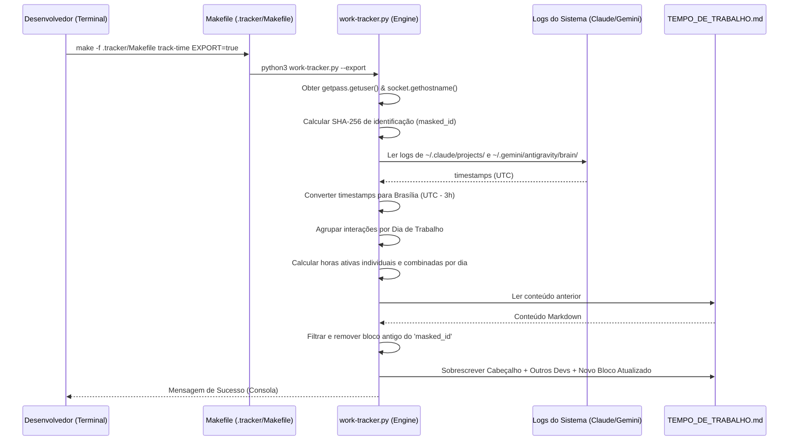

# 📖 Documento de Decisão de Arquitetura (BMad)

Este documento de especificação foi estruturado sob o **Padrão de Arquitetura BMad**, consolidando de forma disciplinada, modular e orientada a decisões a engenharia reversa e a arquitetura de solução do utilitário de métricas de tempo ativo.

---

## 1. Contexto do Projeto e Escopo

### 1.1. Contexto
No desenvolvimento ágil moderno, o uso de assistentes de Inteligência Artificial (**Antigravity** como extensão de IDE/Cursor e **Claude Code** como ferramenta de linha de comando CLI) tornou-se parte vital do tempo de trabalho ativo. No entanto, não havia um mecanismo padronizado, offline e coeso para auditar de forma justa e transparente o tempo produtivo acumulado com essas tecnologias em um repositório git comum.

### 1.2. Escopo da Solução
O **Rastreador de Tempo Ativo (IA)** é um micro-sistema analítico privado, projetado para viver de forma 100% isolada e offline dentro da pasta oculta `.tracker/` na raiz do repositório. Ele mina dados de transações locais dos agentes, consolidando-os em tabelas diárias compartilhadas de forma segura e colaborativa.

---

## 2. Limites do Sistema e Stack Tecnológica

O utilitário foi construído com foco em **zero dependências externas corporativas** para garantir compatibilidade universal em qualquer ambiente de desenvolvimento (Linux/OSX):

*   **Linguagem de Execução:** Python 3.x (utilizando estritamente a biblioteca padrão `stdlib` - `os`, `re`, `json`, `glob`, `hashlib`, `socket`, `datetime`).
*   **Interface do Desenvolvedor (DX):** GNU Make (Makefile apartado sob `.tracker/Makefile`).
*   **Fuso Horário de Referência:** Fuso Horário de Brasília (GMT-3 / America/Sao_Paulo).
*   **Destino Analítico:** Arquivos Markdown com tags estendidas GFM (GitHub Flavored Markdown).

---

## 3. Decisões de Design de Solução (ADRs - Architecture Decision Records)

### ADR-01: Isolamento de Escopo da Ferramenta de Métricas
*   **Status:** Aprovado
*   **Contexto:** O projeto principal visa automatizar e implantar um cluster Kubernetes local via GitOps. Incluir lógicas de métricas no Makefile principal ou na pasta `scripts/` da raiz violaria a coesão do repositório.
*   **Decisão:** Centralizar toda a lógica, automações e relatórios Markdown em uma pasta oculta específica e apartada: `.tracker/`.
*   **Consequência:** Limpeza absoluta na raiz do projeto; o Makefile principal e a pasta `scripts/` permanecem focados apenas em automação de infraestrutura.

### ADR-02: Algoritmo de Agrupamento por Sessões Ativas (*Session Gap*)
*   **Status:** Aprovado
*   **Contexto:** O tempo de desenvolvimento com IA é intermitente. Não podemos apenas medir a diferença do primeiro para o último commit.
*   **Decisão:** Implementar agrupamento de comandos brutas consecutivos. Se a diferença de tempo entre duas interações for **menor ou igual a 45 minutos**, elas fazem parte da mesma sessão ativa. Sessões curtas com menos de 15 minutos são arredondadas para 15 minutos (engajamento mínimo).
*   **Consequência:** Precisão científica no cálculo do tempo real em que o desenvolvedor esteve focado na IDE/CLI.

### ADR-03: Prevenção de Dupla Contagem (Uso Simultâneo de Ferramentas)
*   **Status:** Aprovado
*   **Contexto:** O desenvolvedor pode alternar entre IDE (Antigravity) e console (Claude Code) simultaneamente no mesmo período de trabalho. Somar as horas de ambas de forma isolada duplicaria o tempo de desenvolvimento real.
*   **Decisão:** Realizar a concatenação de todos os carimbos de data/hora convertidos para Brasília (GMT-3) e rodar o algoritmo de agrupamento na lista combinada e ordenada.
*   **Consequência:** Obtenção de um **Tempo Combinado Único** líquido e justo, livre de sobreposições de uso simultâneo.

### ADR-04: Privacidade por Mascaramento SHA-256
*   **Status:** Aprovado
*   **Contexto:** Comitar logs de desenvolvimento em repositórios públicos externos no GitHub pode vazar informações sigilosas como nomes de usuários de sistemas operacionais e nomes de computadores da rede interna corporativa.
*   **Decisão:** Substituir a identificação em texto claro por um hash SHA-256 determinístico de 8 caracteres (`dev-[hash]`), calculado combinando `usuario@computador`.
*   **Consequência:** Anonimato impecável para auditores e público externo, enquanto o time mantém a rastreabilidade interna ao ver seus hashes gerados na saída privada do terminal local.

---

## 4. Estrutura de Pastas e Componentes

A arquitetura de arquivos sob `.tracker/` está organizada de forma modular:

```text
.tracker/
├── Makefile            # DX Interface: Ponto de entrada de comandos make do desenvolvedor
├── README.md           # Developer Guide: Instruções conceituais de quando e como utilizar
├── work-tracker-architecture.md # Architecture Spec: Este documento formal de arquitetura BMad
├── work-tracker.py     # Analytics Engine: Script em Python contendo os algoritmos de coleta e análise
└── TEMPO_DE_TRABALHO.md# Collaborative Log: Arquivo Markdown comitado com os dados anonimizados por dia
```

---

## 5. Padrões de Implementação e Regras de Consistência

Para garantir que novos desenvolvedores adicionem suporte a novas IAs no futuro de forma coesa, as seguintes diretrizes de consistência são impostas:

1.  **Imutabilidade de Outros Blocos:** Ao escrever no arquivo [TEMPO_DE_TRABALHO.md](file:///home/ismael.sjunior/git-pessoal/cluster-kubernetes/.tracker/TEMPO_DE_TRABALHO.md), o analisador deve **sempre ler o arquivo anterior**, filtrar blocos com IDs mascarados diferentes e reescrevê-los exatamente como estavam. Blocos de outros desenvolvedores nunca devem ser alterados ou apagados.
2.  **Deduplicação Dinâmica:** Se o ID mascarado do desenvolvedor atual já possuir um registro prévio no arquivo, este registro antigo deve ser **substituído in-place** pela nova medição recalculada, em vez de criar múltiplos blocos duplicados para a mesma máquina.
3.  **Fuso Horário Local Estrito:** Toda exibição de data e hora no Markdown ou console de métricas deve utilizar o fuso horário de Brasília (GMT-3) de forma proativa.

---

## 6. Fluxo de Dados e Interfaces de Componentes

### 6.1. Fluxo de Execução do Script
O diagrama abaixo detalha o processamento modular do `work-tracker.py` ao ser invocado:



---

## 7. Diretrizes de Segurança e Validação

Para manter a confiabilidade das métricas no ciclo de vida de desenvolvimento:

*   **Prevenção de Injeção de Logs:** Os logs devem ser purificados contra quebras de linha ou caracteres não-JSON antes do processamento.
*   **Idempotência:** A execução sucessiva de comandos de exportação não causa efeitos colaterais na formatação do Markdown.
*   **Segurança de Paths:** Os caminhos de varredura usam caminhos de sistema seguros baseados no diretório do usuário local (`os.path.expanduser`), evitando ataques de travessia de diretório.
